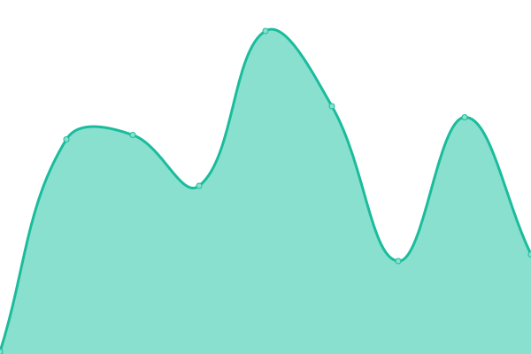

# [📈 Live Status](https://up.solarft.tk): <!--live status--> **🟩 All systems operational**

This repository contains the open-source uptime monitor and status page for [Ahmad Ibrahim Shahmi](https://solarft.tk), powered by [Upptime](https://github.com/upptime/upptime).

With [Upptime](https://upptime.js.org), you can get your own unlimited and free uptime monitor and status page, powered entirely by a GitHub repository. We use [Issues](https://github.com/solarft/upptime/issues) as incident reports, [Actions](https://github.com/solarft/upptime/actions) as uptime monitors, and [Pages](https://up.solarft.tk) for the status page.

<!--start: status pages-->
<!-- This summary is generated by Upptime (https://github.com/upptime/upptime) -->
<!-- Do not edit this manually, your changes will be overwritten -->
<!-- prettier-ignore -->
| URL | Status | History | Response Time | Uptime |
| --- | ------ | ------- | ------------- | ------ |
|  [Personal Website](https://solarft.tk) | 🟩 Up | [personal-website.yml](https://github.com/solarft/upptime/commits/HEAD/history/personal-website.yml) | 

 332ms
     
 | 

<a href="https://up.solarft.tk/history/personal-website">100.00%</a>
    

|  [iiMarcus' Website](https://iimarcus.netlify.app) | 🟩 Up | [ii-marcus-website.yml](https://github.com/solarft/upptime/commits/HEAD/history/ii-marcus-website.yml) | 

 386ms
     
 | 

<a href="https://up.solarft.tk/history/ii-marcus-website">100.00%</a>
    

<!--end: status pages-->

[**Visit our status website →**](https://up.solarft.tk)

## 📄 License

- Powered by: [Upptime](https://github.com/upptime/upptime)
- Code: [MIT](./LICENSE) © [Ahmad Ibrahim Shahmi](https://solarft.tk)
- Data in the `./history` directory: [Open Database License](https://opendatacommons.org/licenses/odbl/1-0/)
